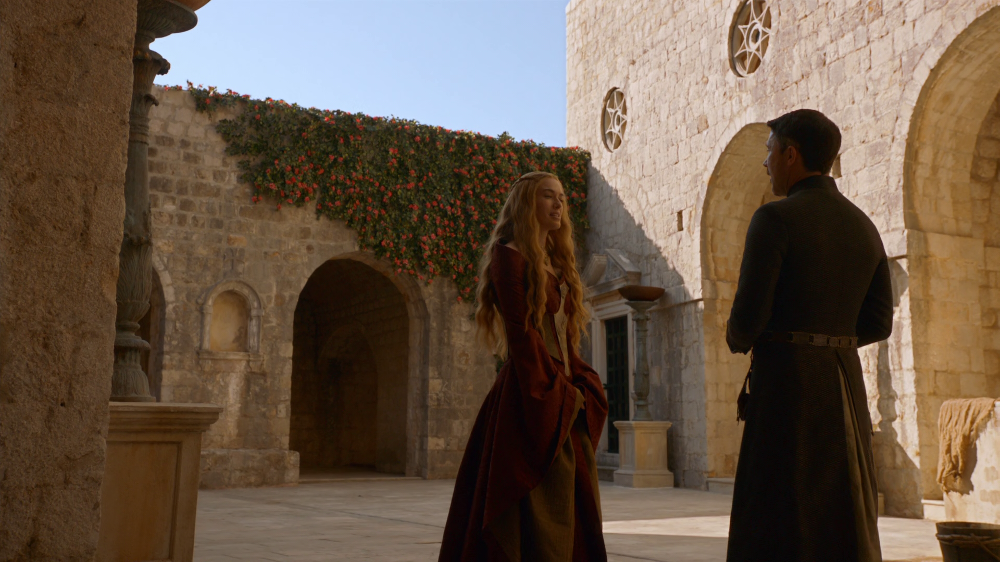
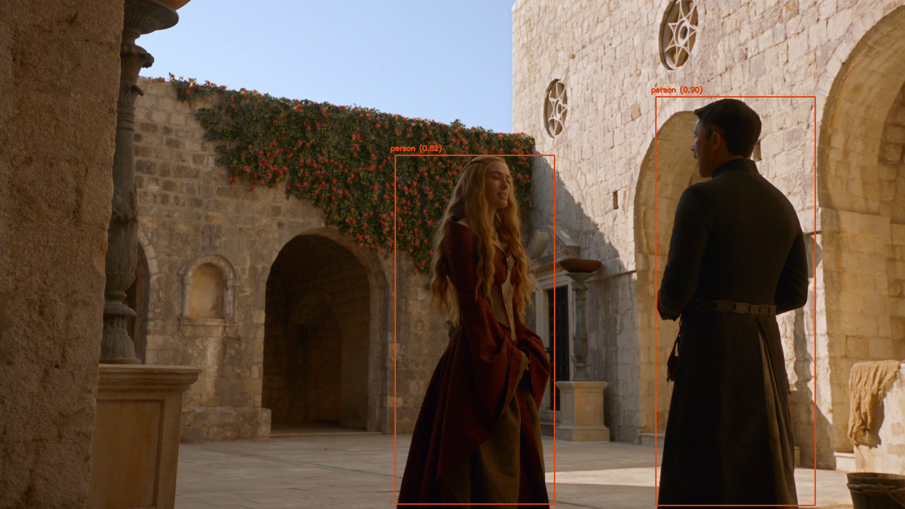
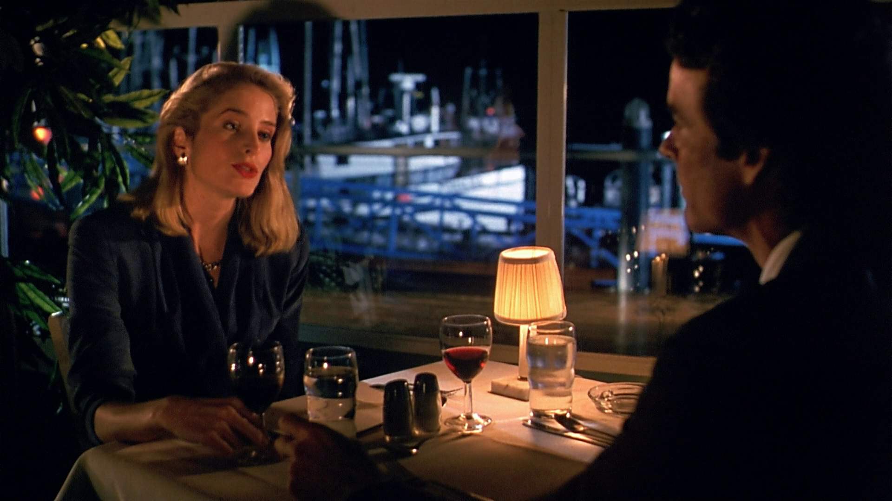
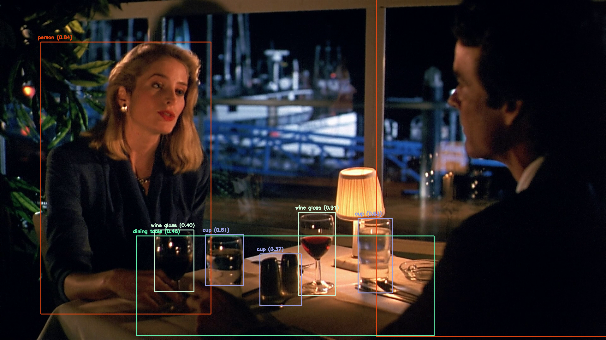

# Object Detection with YOLO and OpenCV

This example demonstrates how to implement [Ultralytics YOLOv8](https://docs.ultralytics.com/models/yolov8/) object detection using [OpenCV](https://opencv.org/) in [Python](https://www.python.org/), leveraging the [ONNX (Open Neural Network Exchange)](https://onnx.ai/) model format for efficient inference.

| Original | Output |
|----------|--------|
|  |  |
|  |  |

# Setup

## Clone
```bash
git clone https://github.com/weslleyskah/detector.git
cd detector
```

## Requirements
```bash
uv pip install -r requirements.txt
```

## Model

```bash
uv run yolo export model=yolov8n.pt imgsz=640 format=onnx opset=12
```

## Image
Download a sample image or use a local one.
Save it as ``image.jpg`` inside the``detector`` directory.

## Run
The script will perform object detection on the images and save the results on ``data/img/output``.
```bash
cd detector/src

# Run one image
uv run main.py --model yolov8n.onnx --img image.png
# Run multiple images
uv run main.py
```